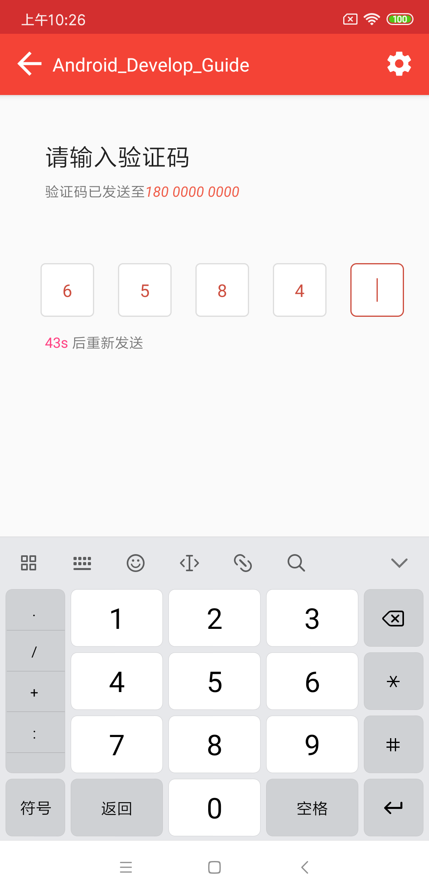

## JellyBoxLayout - An Android JellyBoxLayout Library, now in Kotlin!

一个 Android 验证码输入框控件。

[](http://developer.android.com/index.html)
[](https://bintray.com/aboust/android/jellyboxlayout/_latestVersion)
[](https://img.shields.io/github/license/cyzaoj/JellyBoxLayout) 
[](https://img.shields.io/github/license/cyzaoj/JellyBoxLayout) 


<BR>
##DEMO


<BR>
<BR>

## Configure

#### Maven
```xml
<dependency>
  <groupId>com.aboust.jelly</groupId>
  <artifactId>jellyboxlayout</artifactId>
  <version>${latestVersion}</version>
  <type>pom</type>
</dependency>
```

#### JCenter

First. add to project build.gradle

``` gradle
repositories {
    jcenter()
}
```

Second. add to module build.gradle

```gradle
implementation "com.aboust.jelly:jellyboxlayout:${latestVersion}"
```

## Attributes instruction
attribute|instruction|value
---|---|---
[box_figures](library/src/main/res/values/attrs.xml)|输入框个数|integer
[box_input_type](library/src/main/res/values/attrs.xml)|number, numberPassword, text ,textPassword|enum
[box_width](library/src/main/res/values/attrs.xml)|输入框宽度设置|dimension,reference
[box_height](library/src/main/res/values/attrs.xml)|输入框高度设置|dimension,reference
[box_text_color](library/src/main/res/values/attrs.xml)|输入框字体颜色|color,reference
[typeface_assets](library/src/main/res/values/attrs.xml)|输入框内字体样式(从assets获取)|string
[box_text_size](library/src/main/res/values/attrs.xml)|输入框内字体大小|dimension,reference
[box_background](library/src/main/res/values/attrs.xml)|输入框背景设置|reference
[box_cursor_drawable](library/src/main/res/values/attrs.xml)|输入框光标设置|reference
[box_spacing](library/src/main/res/values/attrs.xml)|输入框间距设置|dimension,reference

<BR>
## Usage

use in the layout


``` xml

     <com.aboust.jellybox.JellyBoxLayout
            android:id="@+id/jelly_box_layout"
            android:layout_width="wrap_content"
            android:layout_height="wrap_content"
            app:box_background="@color/colorAccent"
            app:box_figures="4"
            app:box_height="40dp"
            app:box_input_type="textPassword"
            app:box_spacing="10dp"
            app:box_text_color="@android:color/white"
            app:box_text_size="12sp"
            app:box_width="40dp"
            app:typeface_assets="CG_Omega_Bold_Italic.ttf" />
        
```

